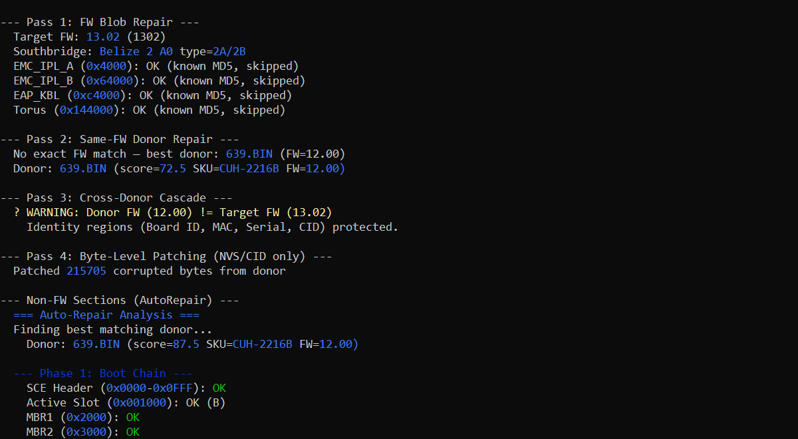
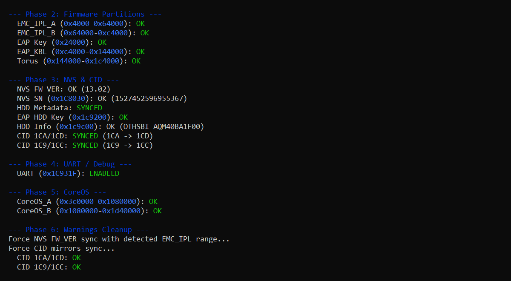
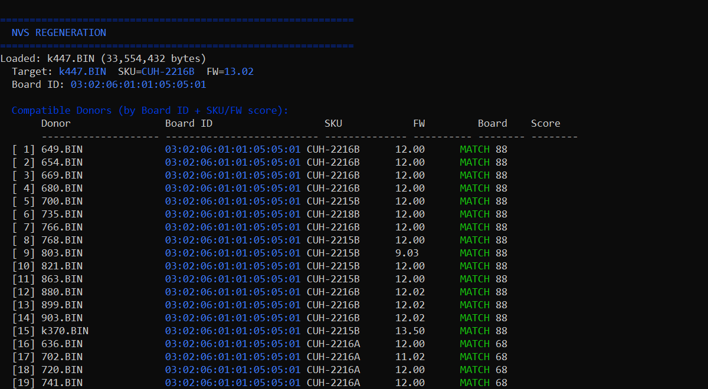
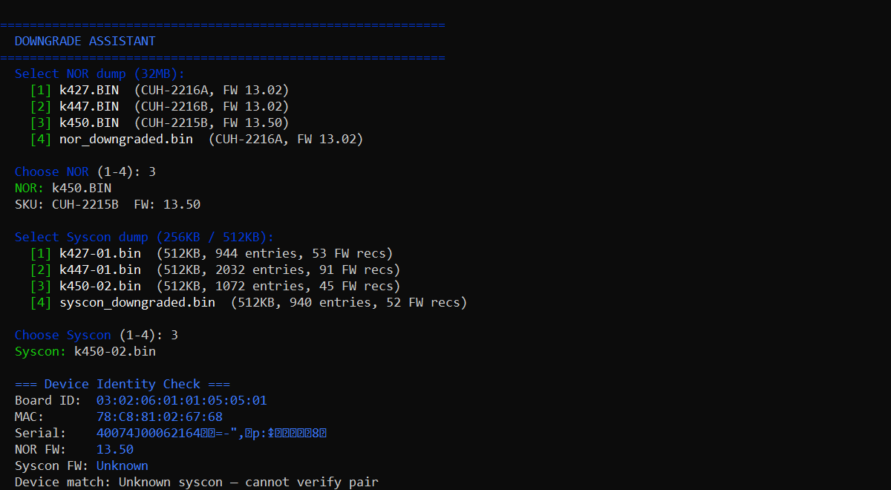
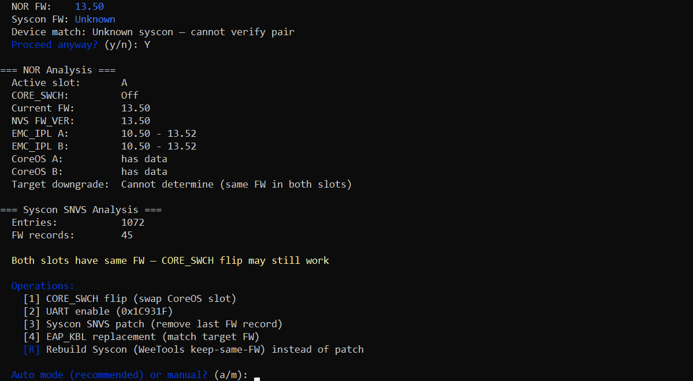
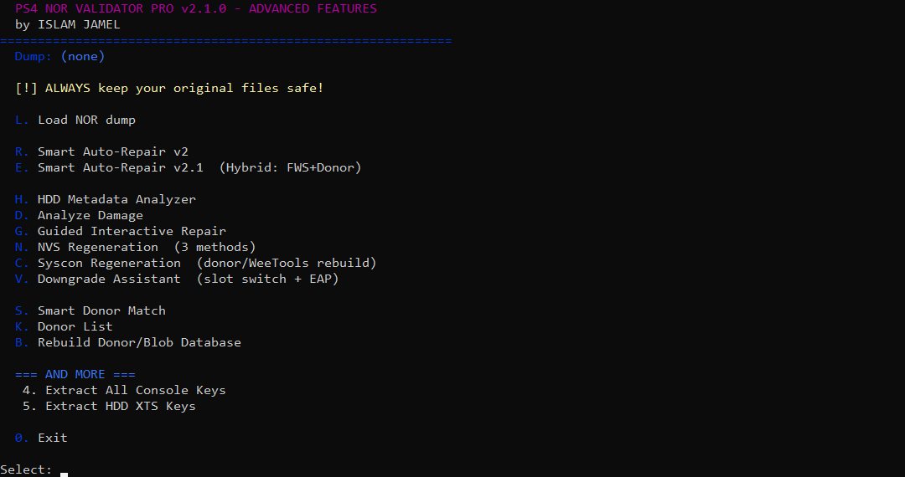

# PS4 NOR Validator Pro v2

> **v2.2.1** — PS4 NOR dump analysis, validation, repair, and Syscon matching tool.

Advanced PS4 NOR analysis, Syscon regeneration, and repair tool with AI-assisted matching.

[](https://github.com/ISLAMGAZA/PS4_NOR_Validator_Pro_v2/releases/tag/v2.2.1)
[](LICENSE)

## Screenshots

| Main Menu | Hybrid Auto-Repair v2.1 |
|:---:|:---:|
|  |  |

| HDD/NVS Analyzer | Syscon Damage Analysis |
|:---:|:---:|
|  |  |

| Downgrade Assistant | Smart Donor Matching |
|:---:|:---:|
|  |  |

## Features

### NOR Repair
- **Hybrid Auto-Repair v2.1** — 4-pass pipeline (FW Blob, Same-FW Donor, Cross-Donor Cascade, Byte-Level with identity protection)
- **Smart Auto-Repair v2** — Automated repair with donor matching
- **HDD/NVS Analyzer** — 9 sub-region health check, CID mirror sync
- **NVS Regeneration** — 3 methods (Accurate Bytes, Blind Copy, Combined) with Board ID filtering
- **Downgrade Assistant** — CORE_SWCH slot flip, UART enable, EAP_KBL replacement
- **SLB2 Rebuilder** — Secure boot partition repair
- **Legitimate CoreOS Patch** — Advanced boot patching

### Syscon
- **Syscon↔NOR Matcher** — Matches a NOR dump to the best syscon donor by chip + ARV + Board ID + EAP MD5
- **Syscon Regeneration** — WeeTools rebuild, donor-based, from-scratch SNVS generation
- **Syscon Damage Analysis** — 4 severity levels with graduated auto-repair (Light/Medium/Heavy/Full)
- **Syscon FW Recovery** — Copy firmware area from donor while preserving target SNVS
- **Debug Mode Toggle** — Enable/disable syscon UART debug

### Keys & Identity
- **Console Keys Extractor** — IDPS, PSID, EAP keys, HDD XTS keys, VTRM (PRE0-PRE3), SSC/SSK
- **ES Chip / eFuse Reader** — Anti-rollback version, model/region flags, secure boot flags
- **Board ID & MAC Protection** — Identity ranges preserved during all repair passes

### Database
- **ARV→FW Mapping** — 296 entries built from 448 paired dumps (FW 9.00–13.52)
- **Syscon Donors** — 864 unique MD5-indexed syscon files
- **NOR Donors** — 811 indexed NOR dumps

## Quick Start

### Download
Get the latest EXE from the [Releases page](https://github.com/ISLAMGAZA/PS4_NOR_Validator_Pro_v2/releases).

### Setup
Place the EXE in a folder with these subdirectories:

```
PS4_NOR_Validator_Pro_v2.exe
├── donors/          (811 NOR dumps — for donor-based repair)
├── syscon_donors/   (864 Syscon dumps — for Syscon matching)
├── fws/             (FW blob .2bls files — for Pass 1 hybrid repair)
├── data/            (bundled in EXE)
├── revert/          (optional — user revert dumps)
└── dumps/           (optional — working directory)
```

> The tool starts without `donors/` or `syscon_donors/`, but repair features will not function without them.

### Menu Overview

| Key | Feature |
|-----|---------|
| **L** | Load NOR dump |
| **R** | Smart Auto-Repair v2 |
| **E** | Hybrid Auto-Repair v2.1 |
| **H** | HDD Metadata Analyzer |
| **D** | Analyze Damage |
| **G** | Guided Interactive Repair |
| **N** | NVS Regeneration (3 methods) |
| **C** | Syscon Regeneration |
| **V** | Downgrade Assistant |
| **S** | Smart Donor Match |
| **T** | **Syscon↔NOR Matcher** |
| **K** | Donor List |
| **B** | Rebuild Donor/Blob Database |
| **4** | Extract Console Keys |
| **5** | Extract HDD XTS Keys |

### Typical Workflow

1. **L** — Load your NOR dump
2. **H** — Analyze HDD/NVS metadata
3. **D** — Check for damage
4. **T** — Match NOR to best syscon donor
5. **E** — Run Hybrid Auto-Repair
6. **V** — Use Downgrade Assistant (if needed)
7. **Save** the repaired dump when prompted

## Requirements

- **Windows** 7/10/11 (64-bit)
- ~30GB free space for donors + syscon data
- OR Python 3.9+ (if running from source)

## Required External Files

The following are **not bundled** with the EXE:

| Folder | Contents | Source |
|--------|----------|--------|
| `donors/` | Clean NOR dumps from working consoles | Community collection |
| `syscon_donors/` | Clean Syscon dumps (chip-indexed) | Community collection |
| `fws/` | FW blob database (.2bls files) | [AndyMan/ps4-ic-fw](https://github.com/andy-man/ps4-ic-fw) |
| `revert/` | User revert dumps | Your backups |

## Database Stats

| Metric | Count |
|--------|-------|
| Unique Syscon MD5s | 864 |
| ARV→FW Mappings | 296 |
| Syscon Chip Types | CXD90025G, CXD90044G, CXD90068G |
| FW Range Covered | 8.50 – 13.52 |
| NOR Donors | 811 |

## Built With

- [Python 3.9](https://www.python.org/)
- [PyInstaller](https://pyinstaller.org/) — EXE packaging
- [Flask](https://flask.palletsprojects.com/) — Web UI (upcoming)
- [WeeTools PRO](https://github.com/andy-man/ps4-wee-tools) — Reference implementation

## License

**GPL-3.0** — Open source. Contributions welcome.

## Important Notes

- Always keep backups of your original NOR dump
- Console identity (Board ID, MAC, Serial, CID, EAP keys) is preserved during repair
- This is a community tool with no affiliation to Sony Interactive Entertainment
- Use at your own risk

## Credits

- **ISLAMGAZA** — Development
- **AndyMan** — WeeTools PRO, FW blobs database
- **BwE** — Original PS4 NOR Validator
- [PSDevWiki](https://www.psdevwiki.com/ps4/) — PS4 hardware documentation
